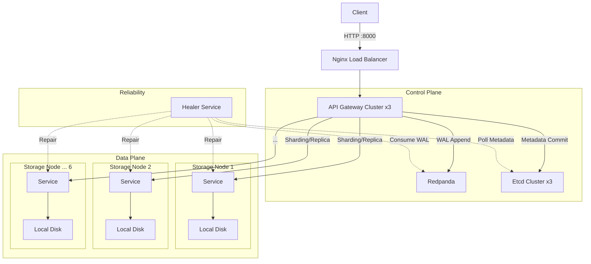
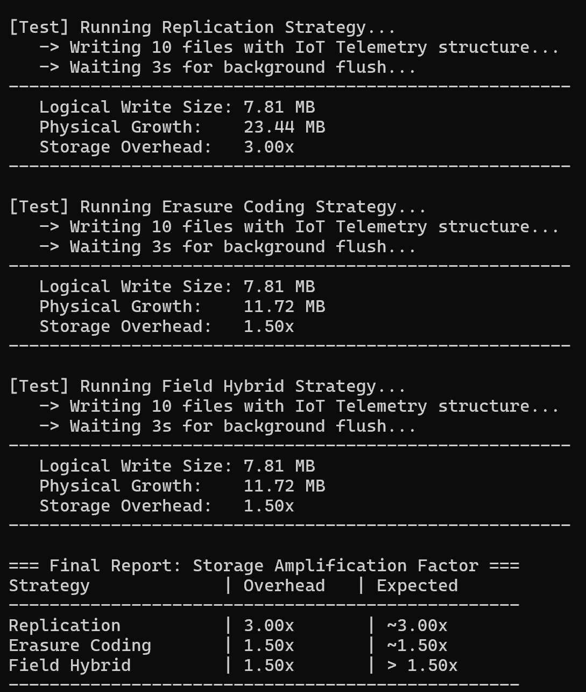

# Replication + Erasure Coding Object Store

Fault-tolerant distributed object storage system written in Go. It features a novel **Field-Level Hybrid Storage** strategy, optimizing costs by automatically splitting object (JSON data) into "Hot" (Replicated) and "Cold" (Erasure Coded) partitions based on access patterns.

This system addresses the write amplification problem inherent in traditional object storage systems when handling large, structured data with frequent metadata updates.


## **Features**

- **Multi-Strategy Storage**
    - **Replication**: Ensures high availability for critical data.
    - **Erasure Coding (RS 4+2)**: Maximizes storage efficiency for larger data blobs.
    - **Field Hybrid**: Automatically separates frequently accessed fields (Hot) from bulk data (Cold).
        - **Automatic Tiering**: Automatically splits a JSON object into Hot Data (Replicated) and Cold Data (Erasure Coded RS 4+2).
        - **Pure Hot Update**: Calculates SHA-256 hashes to detect if cold data remains unchanged. If matched, it skips expensive EC encoding and backend I/O.

- **Self-Healing System**
    - **Leader Election**: Background `Healer` nodes compete for leadership to prevent race conditions.
    - **Active Polling (Maintenance)**: Periodically scans metadata to repair bit rot or insufficient replicas (Partial Writes).
    - **Crash Recovery (WAL Consumer)**: Listens to the write-ahead log to detect and "resurrect" orphaned transactions caused by API Gateway failures.
    - **Redpanda as WAL**: Decouples the Write-Ahead Log from metadata storage. Provides crash recovery guarantees.
    - **Etcd for Metadata**: Acts as the single source of truth.
    - **Best-Effort Availability**: The system accepts partial writes (e.g., 1/3 replicas) to ensure high availability, marking them as `dirty` for background repair (Eventual Consistency).


## Architecture

The system is deployed as a microservices cluster via Docker Compose:



### Component Roles

| Service | Scale | Description |
| --- | --- | --- |
| **API Gateway** | 3x | Traffic entry point. Handles Hash calculation, EC sharding, and coordinates WAL/Storage writes. |
| **Redpanda** | 1x | **Distributed WAL**. Stores write intents (PENDING state) with high throughput using Kafka protocol. |
| **Etcd Cluster** | 3x | **Metadata Store**. Stores object locations and commit states. |
| **Storage Node** | 6x | **Data Warehouse**. Stores actual data blobs using non-blocking buffered writes (Async I/O). |
| **Healer** | 2x | **Recovery**. Dual-Track Recovery. Combines Polling (for maintenance) and WAL Consuming (for crash recovery) to ensure zero data loss. |

## Getting Started

### Prerequisites

- Docker
- Docker Compose
- Go 1.24+ (for local development)

### Installation

1. **Clone the repository**
    
    ```
    cd Replication_ErasureCoding_Object_Store
    ```
    
2. **Start the Cluster**
    
    The system utilizes Init Containers to handle all setup tasks (e.g., Topic creation).
    
    ```
    docker-compose up --build
    ```
    
3. **Verify Status**
The API Gateway is exposed at `http://localhost:8000`.
    
    ```
    curl http://localhost:8000/health
    # Output: {"status":"healthy","service":"api_gateway"...}
    ```
    

## Usage Guide

### 1. Upload Data (Write)

You can choose a storage strategy via the `strategy` query parameter.

**Option A: Hybrid Storage (Recommended for JSON)**
This strategy automatically keeps "Hot Fields" (defined in config) on replicas and moves other fields to EC nodes.

```
curl -X POST "http://localhost:8000/write?key=user:1001&strategy=field_hybrid" \
     -H "Content-Type: application/json" \
     -d '{
           "user_id": 1001,
           "view_count": 50,
           "biography": "Long text data that belongs to cold storage..."
         }'
```

**Option B: Erasure Coding (For large files)**

```
curl -X POST "http://localhost:8000/write?key=image.png&strategy=ec" \
     -H "Content-Type: application/json" \
     -d '{"binary_data": "..."}'
```

**Option C: Replication (For critical data)** Best for small, critical data that requires low latency. Stores full copies on 3 nodes.

```
curl -X POST "http://localhost:8000/write?key=config:settings&strategy=replication" \
     -H "Content-Type: application/json" \
     -d '{"theme": "dark", "notifications": true}'
```

### 2. Retrieve Data (Read)

Simply request the key. The system automatically resolves the strategy, retrieves shards/replicas, reconstructs the data, and returns the original JSON.

```
curl http://localhost:8000/read/user:1001
```

### 3. Delete Data

Deletes both metadata and physical data.

```
curl -X DELETE http://localhost:8000/delete/user:1001
```

## Configuration

Key system parameters are defined in `internal/config/config.go`.

| Parameter | Default | Description |
| --- | --- | --- |
| `K` | 4 | Number of Data Shards (Reed-Solomon). |
| `M` | 2 | Number of Parity Shards. |
| `HotFields` | `view_count`, `like_count`... | Fields that are kept in Replication storage during Hybrid writes. |

## Testing

Simple integration tests are provided in the `test/` directory.

**Run the functional test suite:**
This script verifies all strategies (Replication, EC, Hybrid) and edge cases (invalid inputs, updates, deletes).
For all strategies

```
python3 test/simple_test.py
```

For only hybrid strategies

```
python3 test/hybrid_only.py
```


### Storage Efficiency 

The system significantly reduces storage overhead for large objects. We use test/verify_storage_docker.py to measure the Storage Amplification Factor across 6 storage nodes using a realistic IoT scenario.

### Payload (IoT Telemetry)

The test writes JSON objects with the following structure to simulate "Hot" metadata and "Cold" bulk logs:

```
{
  "device_id": "sensor-gh-0001",    // Hot (Replicated)
  "battery_level": 85,              // Hot (Replicated)
  "status_code": 200,               // Hot (Replicated)
  "is_active": true,                // Hot (Replicated)
  "last_sync_ts": 1734842400,       // Hot (Replicated)
  "firmware_version": "v2.4.1",     // Hot (Replicated)
  "sensor_raw_log": "xxxx..."       // Cold (Erasure Coded, 800KB)
}
```

**Run the verification:**

```
python3 test/verify_storage.py
```

**Measured Results (IoT Telemetry Scenario):**
| Strategy | Overhead | 
| --- | --- |
| **Replication** | **3.0000x** | 
| **Erasure Coding** | **1.5000x** | 
| **Field Hybrid** | **~1.5000x** |


## Project Structure

```
.
├── cmd/                       # Entry points
│   ├── api/                   # API Gateway (Main Entry)
│   ├── healer/                # Self-healing service
│   └── storage_node/          # Async I/O Data Node
├── internal/                  # Private library code
│   ├── config/                # Configuration constants
│   ├── ec/                    # Reed-Solomon wrapper
│   ├── etcd/                  # Etcd client wrapper
│   ├── httpclient/            # Connection pooling client
│   ├── interfaces/            # Interface definitions
│   ├── monitoringservice/     # Node status logic
│   ├── mq/                    # Redpanda/Kafka Client Wrapper
│   ├── readservice/           # Read path logic
│   ├── storageops/            # Low-level operations
│   ├── utils/                 # Hashing & Serialization Tools
│   └── writeservice/          # Write path logic (WAL, Hybrid)
├── docs/                      # Documentation
├── test/                      # Legacy Python tests
├── benchmark.js               # K6 Performance Test Suite
├── docker-compose.yaml        # Container orchestration
└── nginx.conf                 # Load balancer config

```
