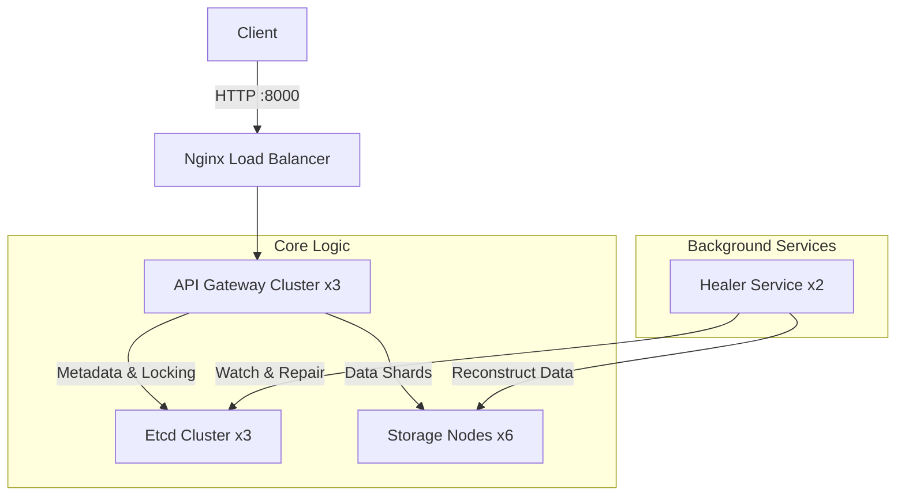

# Replication + Erasure Coding Object Store

Fault-tolerant distributed object storage system written in Go. It features a **Field-Level Hybrid Storage** strategy, optimizing costs by automatically splitting object(JSON data) into "Hot" (Replicated) and "Cold" (Erasure Coded) partitions based on access patterns.

## Features

- **Multi-Strategy Storage**
    - **Replication**: Ensures high availability for critical data.
    - **Erasure Coding (RS 4+2)**: Maximizes storage efficiency for larger data blobs.
    - **Field Hybrid**: Automatically separates frequently accessed fields (Hot) from bulk data (Cold).
- **Atomic Consistency**: Implements **Write-Ahead Logging** backed by Etcd to ensure all transactions are atomic.
- **Self-Healing System**
    - **Leader Election**: Background `Healer` nodes compete for leadership to prevent race conditions.
    - **Auto-Repair**: Automatically reconstructs missing EC shards or copies missing replicas.
    - **Zombie Cleanup**: Rolls back stalled pending transactions automatically.
- **Write Optimization**: Detects "Pure Hot Updates" (when cold data has not changed) to skip expensive EC encoding operations, significantly reducing CPU usage and latency.


## Architecture

The system is composed of microservices deployed via Docker Compose:



### Component Roles

| Service | Scale | Description |
| --- | --- | --- |
| **API Gateway** | 3x | Handles HTTP requests, manages WAL transactions, and performs RS encoding/decoding. |
| **Storage Node** | 6x | Dumb storage units handling raw IO operations. |
| **Healer** | 2x | Background worker handling consistency checks and data repairs. |
| **Etcd Cluster** | 3x | Stores metadata, WAL logs, and handles service discovery. |
| **Nginx** | 1x | Load balancer entry point. |

## Getting Started

### Prerequisites

- Docker
- Docker Compose
- Go 1.21+ (optional)

### Installation

1. **Clone the repository**
    
    ```
    cd Replication_ErasureCoding_Object_Store
    
    ```
    
2. **Start the Cluster**
    
    ```
    docker-compose up --build
    
    ```
    
3. **Verify Status**
The API Gateway is exposed at `http://localhost:8000`.
    
    ```
    curl http://localhost:8000/health
    # Output: {"status":"healthy","service":"api_gateway"...}
    
    ```
    

## Usage Guide

### 1. Upload Data (Write)

You can choose a storage strategy via the `strategy` query parameter.

**Option A: Hybrid Storage (Recommended for JSON)**
This strategy automatically keeps "Hot Fields" (defined in config) on replicas and moves other fields to EC nodes.

```
curl -X POST "http://localhost:8000/write?key=user:1001&strategy=field_hybrid" \
     -H "Content-Type: application/json" \
     -d '{
           "user_id": 1001,
           "view_count": 50,
           "biography": "Long text data that belongs to cold storage...",
           "profile_pic": "base64_encoded_image_data..."
         }'

```

**Option B: Erasure Coding (For large files)**

```
curl -X POST "http://localhost:8000/write?key=image.png&strategy=ec" \
     -H "Content-Type: application/json" \
     -d '{"binary_data": "..."}'

```

### 2. Retrieve Data (Read)

Simply request the key. The system automatically resolves the strategy, retrieves shards/replicas, reconstructs the data, and returns the original JSON.

```
curl http://localhost:8000/read/user:1001

```

### 3. Delete Data

Deletes both metadata and physical data. If metadata is missing, it attempts a blind delete to clean up zombie files.

```
curl -X DELETE http://localhost:8000/delete/user:1001

```

## Configuration

Key system parameters are defined in `internal/config/config.go`.

| Parameter | Default | Description |
| --- | --- | --- |
| `K` | 4 | Number of Data Shards (Reed-Solomon). |
| `M` | 2 | Number of Parity Shards. |
| `HotFields` | `view_count`, `like_count`... | Fields that are kept in Replication storage during Hybrid writes. |


## Testing

Simple integration tests are provided in the `test/` directory.

**Run the functional test suite:**
This script verifies all strategies (Replication, EC, Hybrid) and edge cases (invalid inputs, updates, deletes).
For all strategies
```
python3 test/simple_test.py
```

For only hybrid strategies 
```
python3 test/hybrid_only.py
```


## Project Structure

```
.
├── cmd/                       # Entry points (Main applications)
│   ├── api/                   # API Gateway
│   ├── healer/                # Self-healing service
│   └── storage_node/          # Dumb storage node
├── internal/                  # Private library code
│   ├── config/                # Configuration constants
│   ├── ec/                    # Reed-Solomon wrapper
│   ├── etcd/                  # Etcd client wrapper
│   ├── httpclient/            # Connection pooling client
│   ├── interfaces/            # Interface definitions
│   ├── monitoringservice/     # Node status logic
│   ├── readservice/           # Read path logic
│   ├── storageops/            # Low-level delete operations
│   ├── utils/                 # JSON and Hybrid logic
│   └── writeservice/          # Write path logic
├── docs/                      # Documentation
├── test/                      # Integration tests
├── docker-compose.yaml        # Container orchestration
└── nginx.conf                 # Load balancer config
```