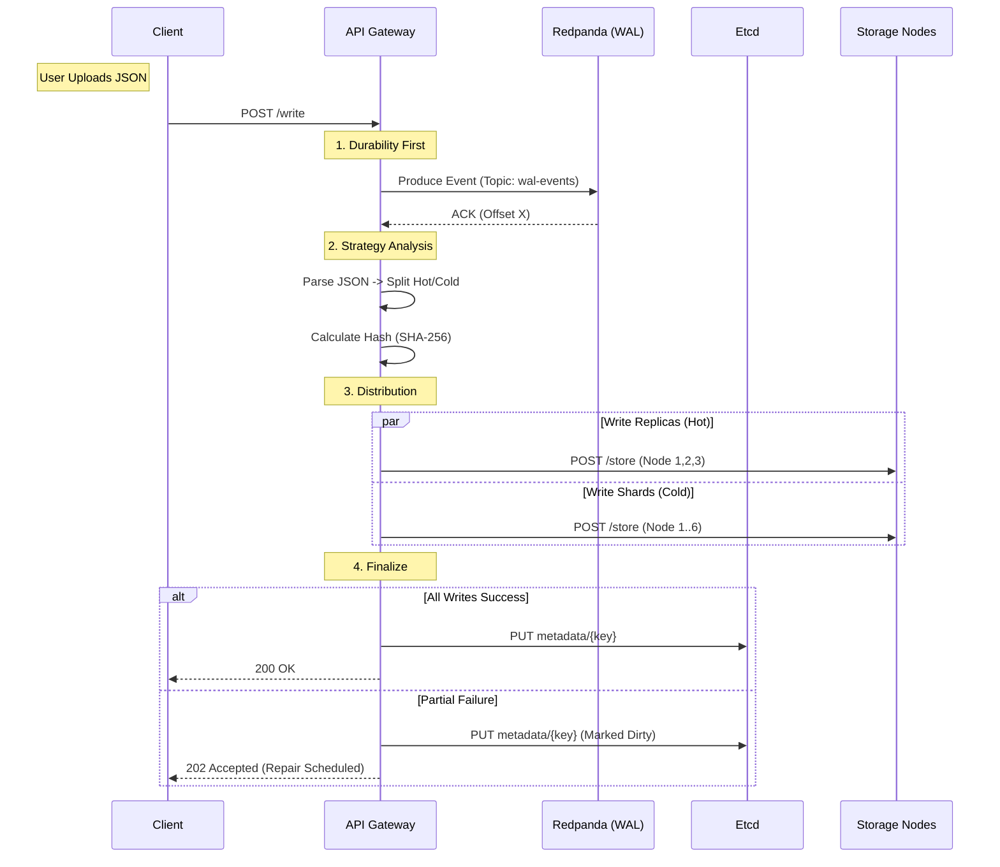
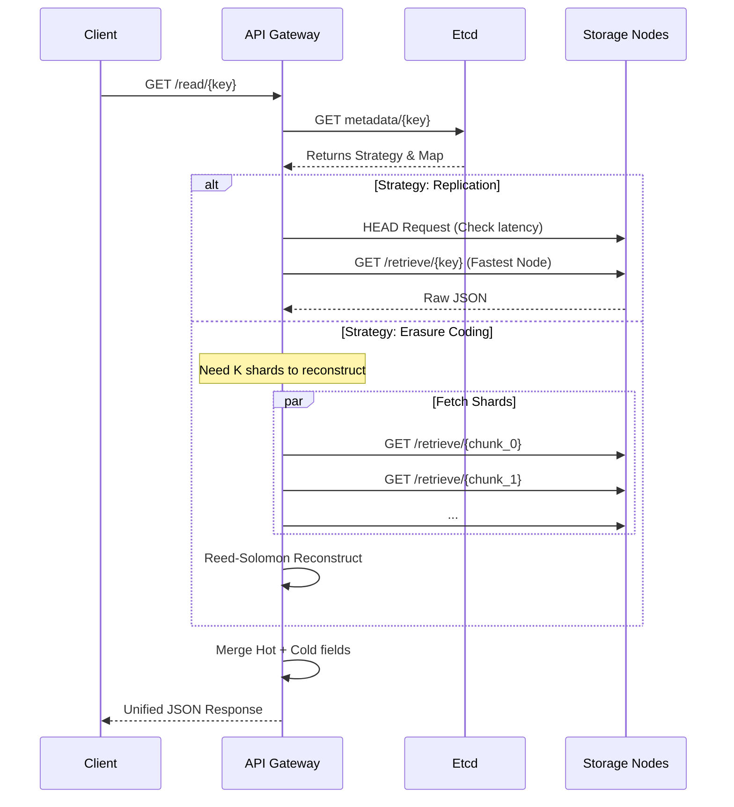

# **Replication + Erasure Coding Object Store** Architecture

This document provides a comprehensive architectural overview of the Replication + Erasure Coding Object Store. It details the system's design principles, component interactions, data flows, and consistency models.

## 1. System Overview

The Replication + Erasure Coding Object Store is designed to balance **Performance** (for hot data) and **Storage Efficiency** (for cold data) using a **Log-Centric Architecture**.

### 1.1 Design Goals

- **Durability**: Zero data loss once a write is acknowledged (via WAL).
- **Efficiency**: Minimize storage overhead for large blobs using Erasure Coding.
- **Self-Healing**: Automatic recovery from node failures without human intervention.
- **Consistency**: Strong consistency for metadata (Etcd), Eventual consistency for object blobs.

### 1.2 CAP Theorem Positioning

- **Metadata (CP)**: We use Etcd to guarantee linearizable consistency for file metadata and node locking.
- **Storage (AP)**: Storage nodes prioritize availability. Inconsistencies are resolved asynchronously by the **Healer**.

## 2. Core Components

The system separates concerns into three distinct planes:

### A. Control Plane

- **Etcd Cluster**:
    - Acts as the **Source of Truth**.
    - Stores file metadata (file size, strategy, node location maps).
    - Handles distributed locking for Leader Election.
    - Stores Service Discovery records (`nodes/health/`).
- **Healer Service**:
    - A stateless worker that performs reconciliation.
    - Active-Standby HA model via Etcd Election.
    - Responsible for repairing lost replicas and reconstructing missing EC shards.

### B. Event Plane

- **Redpanda** :
    - Acts as the **Write-Ahead Log (WAL)**.
    - Decouples ingestion from processing.
    - Ensures write requests are durable even if the API Gateway crashes mid-processing.

### C. Data Plane

- **Storage Nodes**:
    - Stateless HTTP servers.
    - Store raw bytes on the local filesystem.
    - No knowledge of the cluster topology.
- **API Gateway**:
    - Handles client HTTP requests.
    - Performs Erasure Coding (Reed-Solomon) encoding/decoding.
    - Manages sharding logic and node selection.

## 3. Data Flow: The Write Path (Log-Centric)

The write path is designed to be **Crash-Safe**.

### Workflow

## 4. Data Flow: The Read Path

The read path differs significantly based on the storage strategy.

### Workflow

## 5. Storage Strategies

We employ a hybrid approach to optimize costs.

| Feature | Replication | Erasure Coding (RS 4+2) |
| --- | --- | --- |
| **Target Data** | Hot Data (Counters, Status, Small Metadata) | Cold Data (Bios, Long Descriptions, Blobs) |
| **Redundancy** | 3x Copies (300% storage overhead) | 1.5x Overhead (4 Data + 2 Parity) |
| **Fault Tolerance** | Tolerate 2 node failures | Tolerate 2 node failures |
| **Read Perf** | High (Low latency, parallel read) | Medium (CPU overhead for reconstruction) |
| **Write Perf** | High | Medium (CPU overhead for encoding) |

### Field-Level Hybrid Logic

When a JSON object is updated:

1. **Hash Check**: The system calculates the SHA-256 hash of the Cold fields.
2. **Deduplication**: If the hash matches the previous version in Etcd, the **EC Write is skipped entirely**. Only the small Hot data is updated via Replication.

## 6. The Healer (Self-Healing Controller)

The Healer ensures the system converges to a healthy state. It operates as a background daemon.

### 6.1 Architecture: Active-Standby

To prevent race conditions (e.g., two nodes trying to repair the same file simultaneously), Healer instances perform **Leader Election**:

- Uses `etcd/concurrency` session with a 15s TTL.
- Only the **Leader** enters the Control Loop.
- Others wait on the lock key `/healer/leader`.

### 6.2 The Control Loop (Polling)

Every 30 seconds, the Leader:

1. **Scans**: Lists keys in `metadata/`.
2. **Audits**: Checks existence of files on Storage Nodes via HTTP HEAD.
3. **Repairs**:
    - **Replication Repair**: Copies data from a healthy node -> missing node.
    - **EC Repair**: Downloads `K` shards -> Reconstructs `M` missing shards -> Uploads to new nodes.

## Limitations & Future Work

- **Sharding**: Currently, node selection is deterministic based on sorting. A Consistent Hashing Ring (e.g., Ringpop) is needed for dynamic node scaling.
- **Bitrot Detection**: Currently checks for file existence only. Future versions should implement Checksum verification on read/audit.