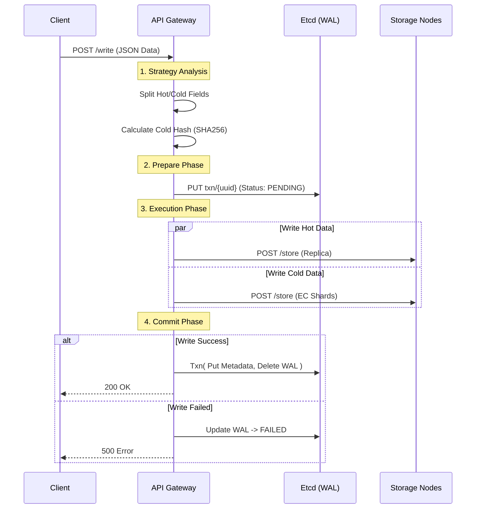
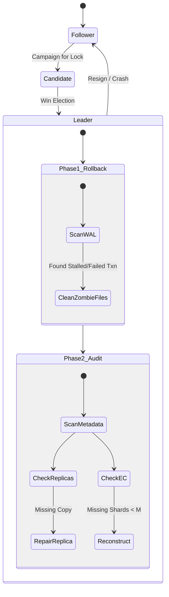

# System Architecture

This document describes the internal design, data flows, and consistency models of the Hybrid Distributed Object Store.

## 1. High-Level Design

The system follows a **Control Plane / Data Plane** separation pattern:

- **Control Plane (Metadata)**: Managed by **Etcd**. It stores object metadata, transaction logs (WAL), and node health status.
- **Data Plane (Blob Storage)**: Managed by **Storage Nodes**. They are dumb servers that simply store raw bytes on disk.
- **Orchestrator**: The **API Gateway** acts as the stateless coordinator, handling logic for striping, replication, and repairing.

## 2. The Write Path (Atomic Transactions)

To ensure data consistency across multiple nodes, we implement a **Two-Phase Commit** protocol using an Etcd-backed Write-Ahead Log (WAL).

### Workflow Diagram

### Transaction States

Every write operation creates a temporary key in Etcd under `txn/`.

1. **PENDING**: The write operation is in progress. If the API crashes here, the `Healer` will detect the stale timestamp and rollback.
2. **COMMITTED**: The atomic transaction in Etcd converts the WAL entry into a permanent `metadata/` entry.
3. **FAILED**: The write failed (e.g., not enough storage nodes). The `Healer` will garbage collect the partial data.

## 3. Storage Strategies

### A. Replication (Hot Data)

- **Use Case**: Small, frequently accessed data (e.g. `like_count`, `last_updated`).
- **Mechanism**: Full copies are stored on 3 nodes.
- **Read Consistency**: First-response-wins .

### B. Erasure Coding (Cold Data)

- **Use Case**: Large blobs (e.g. `biography`).
- **Algorithm**: Reed-Solomon (K=4, M=2).
- **Fault Tolerance**: Can tolerate loss of any 2 nodes.
- **Padding**: Data is zero-padded to fit the matrix requirements. `original_length` is stored in metadata to truncate padding on read.

### C. Field-Level Hybrid

The system parses the input JSON and separates fields based on `config.HotFields`.

**Optimization: Pure Hot Updates**
When a write request comes in, the system calculates `SHA256(NewColdData)`.

- If `NewHash == OldHash`: **Skip EC Encoding & Writing**. Only update the Hot Data replicas.
- If `NewHash != OldHash`: Perform full EC split and write.

## 4. The Healer (Self-Healing)

The Healer service runs in the background to ensure system consistency. It uses **Leader Election** to prevent race conditions.

### Healer State Machine

1. **Leader Election**: Uses `concurrency.Election` from Etcd. Only one Healer is active at a time.
2. **Rollback (Phase 1)**: Scans `txn/` keys. If a transaction is `PENDING` for > 5 minutes or marked `FAILED`, it deletes the physical files on storage nodes to free up space.
3. **Repair (Phase 2)**: Scans `metadata/` keys.
    - **Replica Repair**: If a node is down, copies data from a healthy node to a new node.
    - **EC Repair**: If shards are missing, uses Reed-Solomon `Reconstruct` to regenerate missing chunks and upload them.

## 5. Data Layout

### Etcd Keys

- `nodes/health/{hostname}`: Service discovery heartbeat.
- `metadata/{key}`: JSON object containing strategy, file size, node map, and checksums.
- `txn/{uuid}`: Temporary transaction log.
- `healer_leader_lock`: Distributed lock for the Healer.